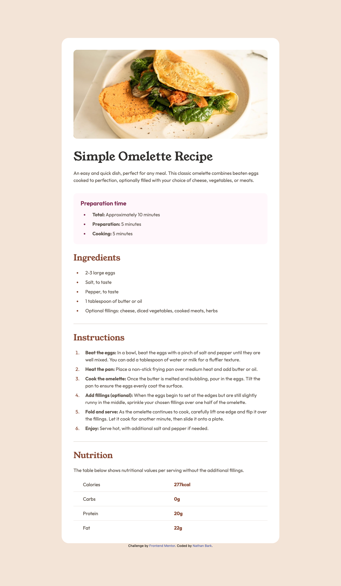

# Frontend Mentor - Recipe page solution

This is a solution to the [Recipe page challenge on Frontend Mentor](https://www.frontendmentor.io/challenges/recipe-page-KiTsR8QQKm). Frontend Mentor challenges help you improve your coding skills by building realistic projects. 

## Table of contents

- [Overview](#overview)
  - [Screenshot](#screenshot)
  - [Links](#links)
- [My process](#my-process)
  - [Built with](#built-with)
  - [What I learned](#what-i-learned)
  - [Continued development](#continued-development)
- [Author](#author)
- [Acknowledgments](#acknowledgments)

## Overview

### Screenshot

### Links

- Solution URL: [Add solution URL here](https://github.com/nathan-bark/recipe-page)
- Live Site URL: [Add live site URL here](https://nathan-bark.github.io/recipe-page/)

## My process

### Built with

- Semantic HTML5 markup
- TailwindCSS
- Mobile-first workflow

### What I learned

Working on this project reinforced my understanding of semantic HTML. I focused on using appropriate tags like `<main>, <section>, <ul>, <ol>`, and `<table>` to give the content a logical structure, which is crucial for accessibility and SEO.

I also gained more experience with Tailwind CSS. I learned to efficiently build a complex layout directly in the HTML using utility classes, which significantly sped up the styling process. I particularly enjoyed implementing responsive design with Tailwind's built-in breakpoints, like tablet:flex and tablet:py-32, to create a seamless experience across different devices.

For example, I used pl-4 on list items to create consistent spacing between the list marker and the text, and tablet:flex flex-col items-center on the body to center the content on larger screens.

### Continued development

In the future, I want to explore CSS Grid with Tailwind CSS to build more complex and flexible layouts. I'd also like to delve deeper into accessibility best practices, particularly using ARIA attributes and more advanced semantic techniques, to ensure my projects are usable for everyone.

## Author

- Frontend Mentor - [@nathan-bark](https://www.frontendmentor.io/profile/nathan-bark)
- LinkedIn - [@nathan-bark](https://www.linkedin.com/in/nathan-bark/)
